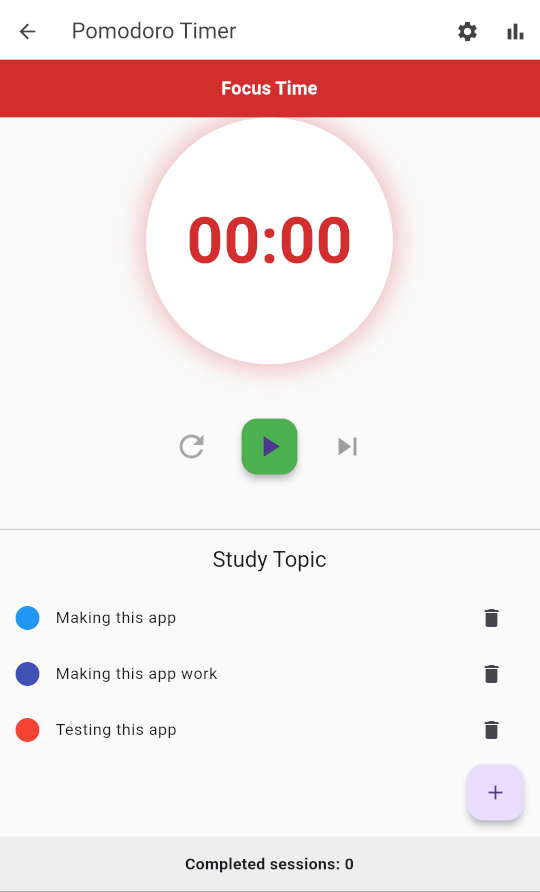
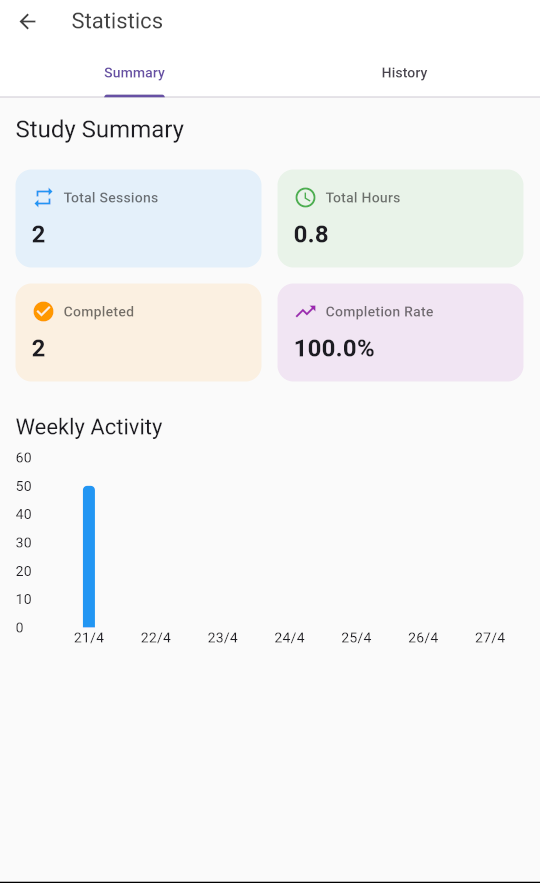
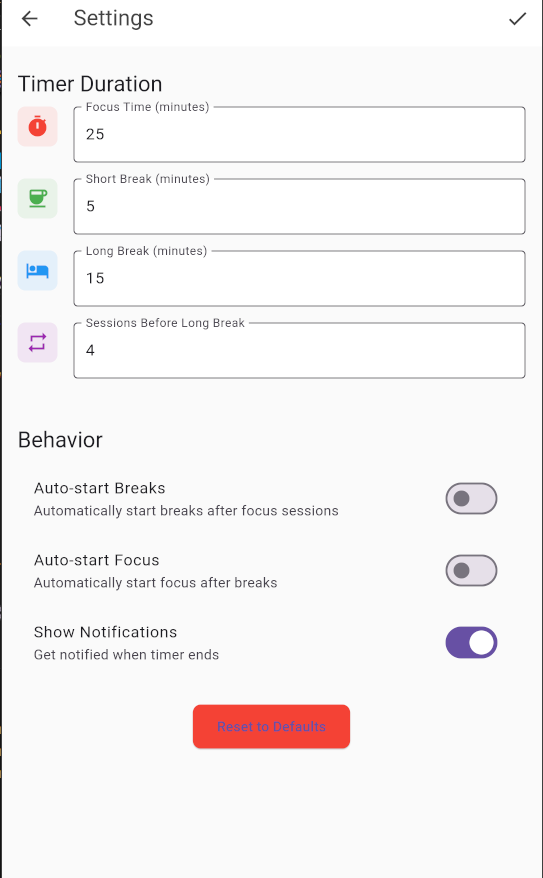

# Pomodoro Timer - App de Organização de Estudos

## 📱 Descrição
Um aplicativo de timer Pomodoro desenvolvido em Flutter para ajudar na organização de estudos. O app permite personalizar tempos de estudo e descanso, além de acompanhar estatísticas de suas sessões.

### Funcionalidades Principais
- ⏰ Timer Pomodoro personalizável
- 🔄 Ciclos de estudo e pausa
- 📊 Estatísticas detalhadas de sessões
- 📝 Acompanhamento de tópicos de estudo
- 📈 Visualização de progresso semanal

## 📸 Capturas de Tela

### Tela Principal

*Timer principal com controles de sessão*

### Estatísticas

*Visualização de estatísticas e progresso*

### Configurações

*Personalização dos tempos e preferências*

## ⚙️ Instalação

### Pré-requisitos
- Flutter SDK
- Android Studio ou VS Code
- Git

### Passos para Instalação

1. Clone o repositório:
```bash
git clone https://github.com/Lucas-Dreveck/pomodoro_timer.git
```

2. Navegue até a pasta do projeto:
```bash
cd pomodoro_timer
```

3. Instale as dependências:
```bash
flutter pub get
```

4. Execute o aplicativo:
```bash
flutter run
```

## 🛠️ Tecnologias Utilizadas
- Flutter
- Provider (Gerenciamento de Estado)
- SQLite (Armazenamento Local)
- fl_chart (Gráficos)

## 📋 Configurações Disponíveis
- Duração da sessão de foco
- Duração da pausa curta
- Duração da pausa longa
- Número de sessões antes da pausa longa
- Início automático de pausas
- Início automático de sessões

## 📊 Recursos de Estatísticas
- Total de sessões realizadas
- Tempo total de estudo
- Taxa de conclusão
- Histórico de sessões
- Gráfico de atividade semanal

## 🤝 Contribuindo
Sinta-se à vontade para contribuir com o projeto através de pull requests ou reportando issues.

---
Desenvolvido por Lucas Dreveck - 2025